# Bshop(e-commerce site)

## Languages:-

* HTML
* CSS
* Javascript
* PHP(core)
* SQL

## Database:-

* MySQL

## Features:-

* Secure Login System
* New user email verification with OTP
* Sign in with Google (Google Auth API)
* Forgot Password
* Payment Gatway Integration (Instamojo Payment API)
* Rating System
* Product Suggestions according to users browsing
* Admin Panel
  * Add, Update, Delete Products
  * Managing orders
  * Site settings

## Home Page

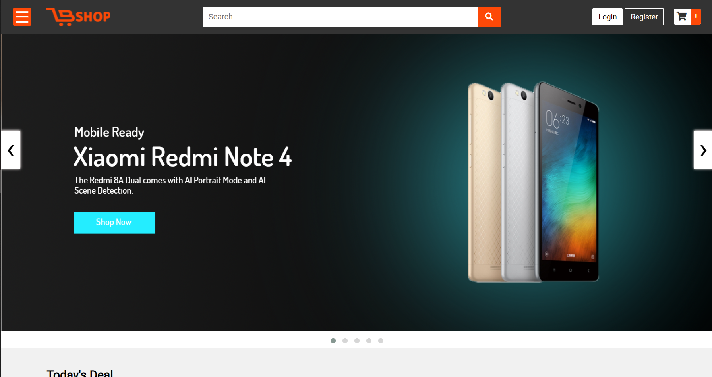

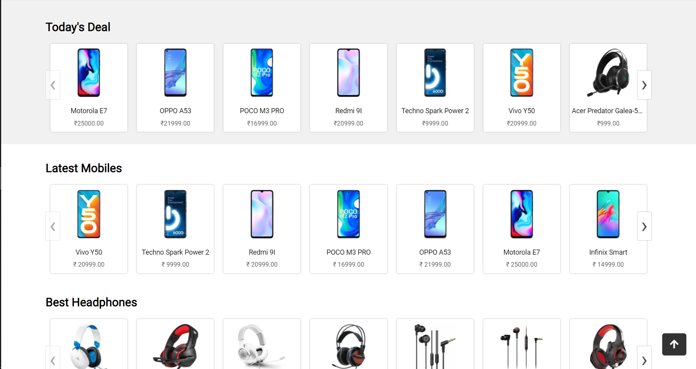

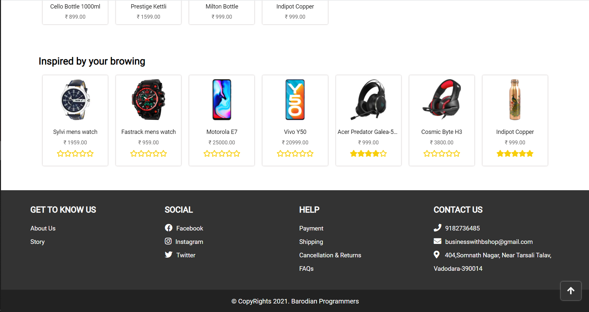

## Product Details

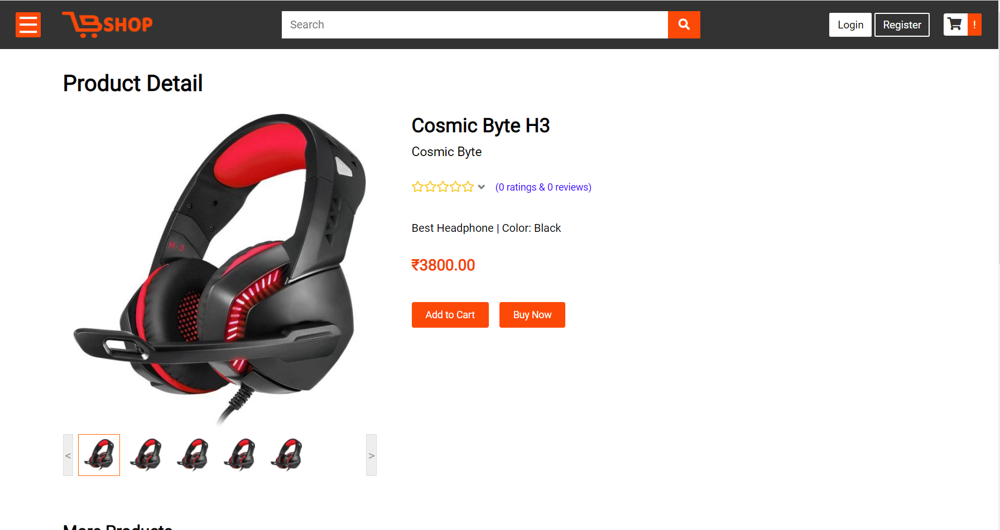

## Cart

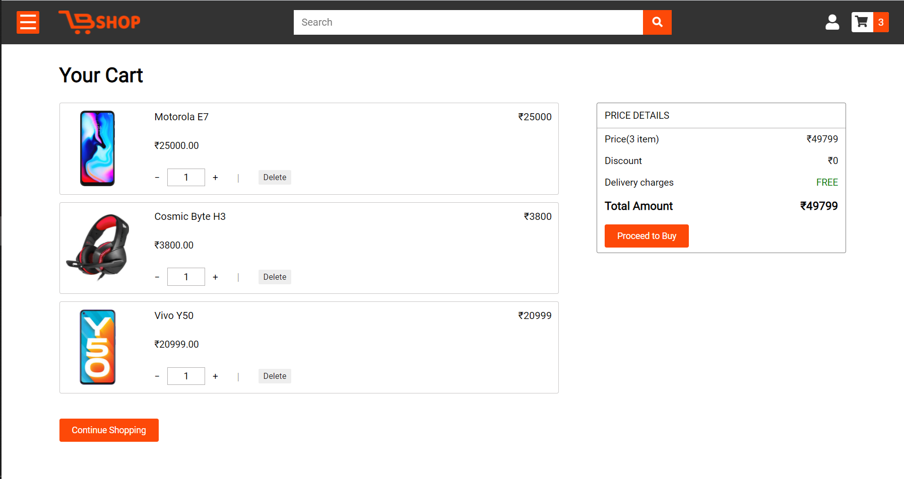

## Orders

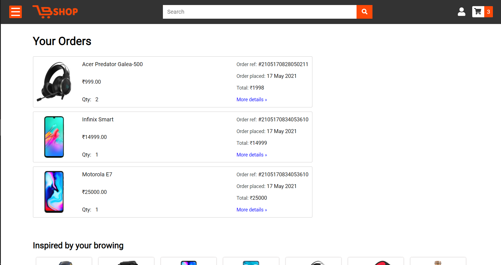

## Rating Page

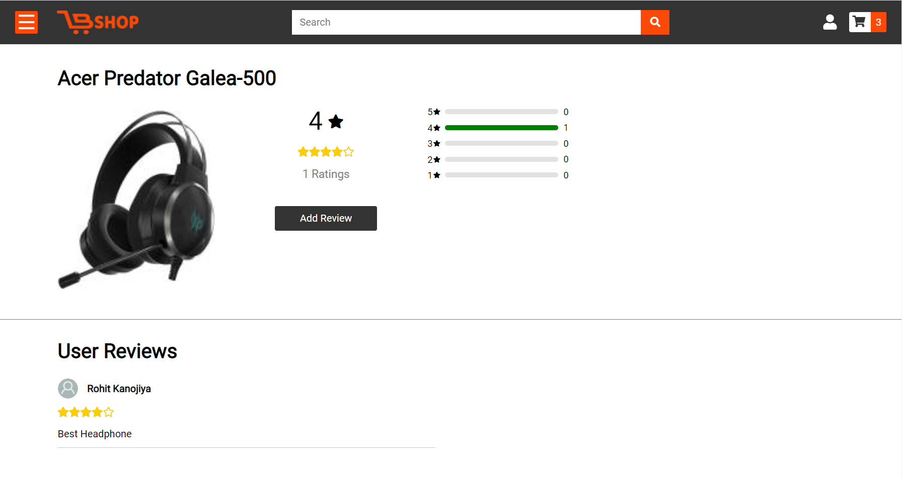

## Rating Model

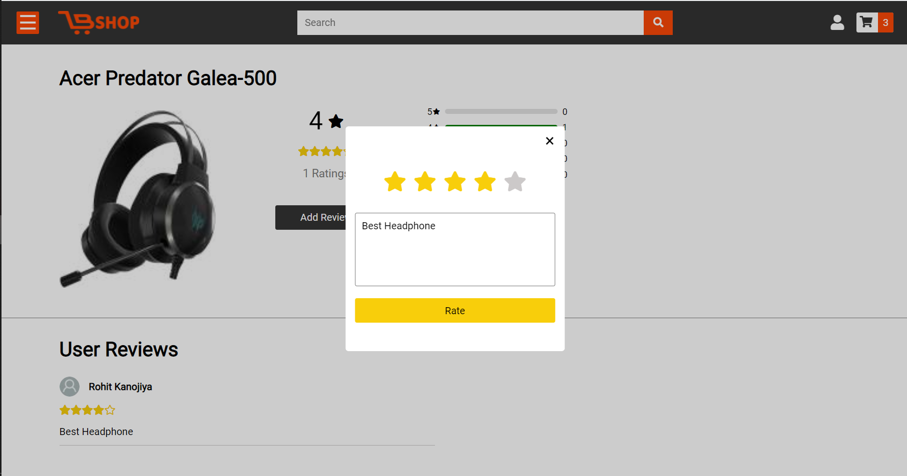

## Login Page

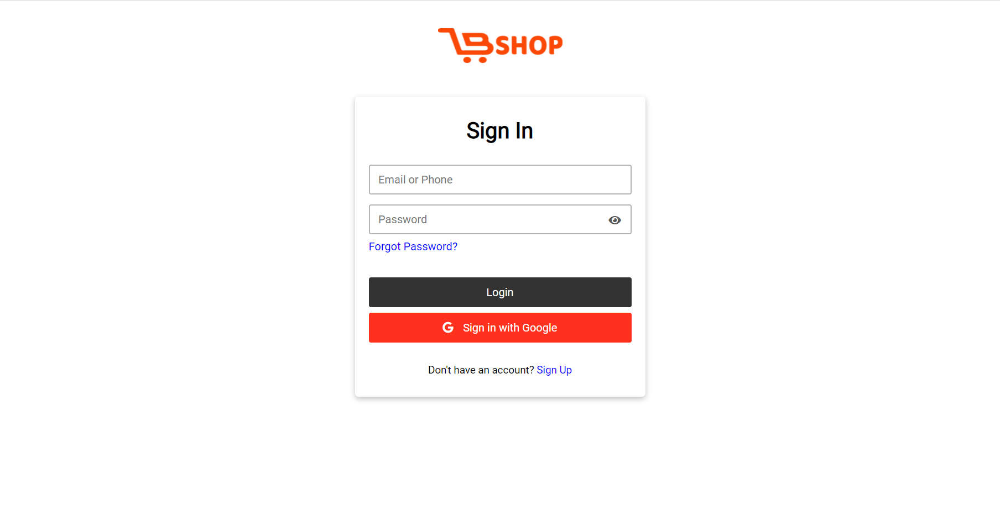

## Register Page

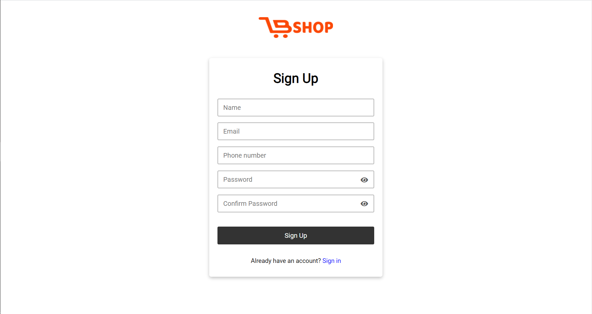

## User Panel

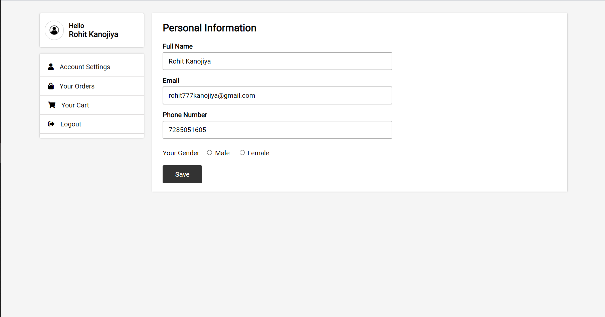

## Admin Panel

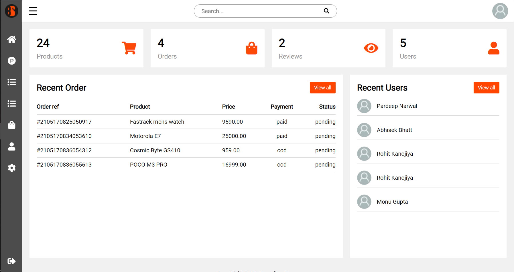

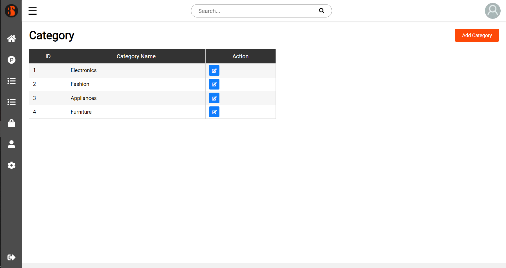

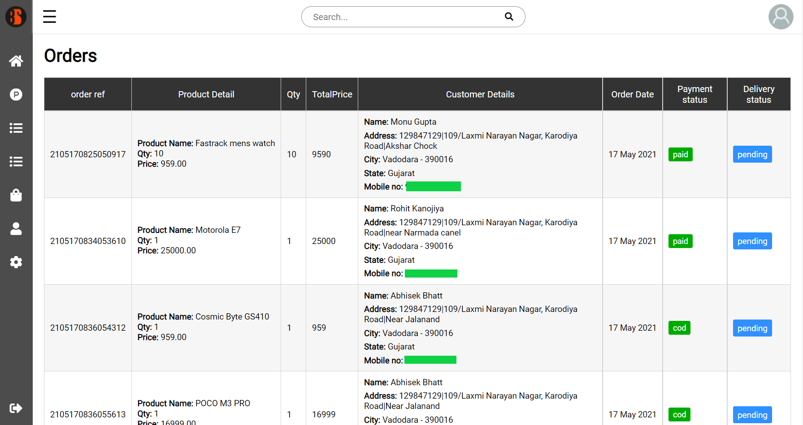

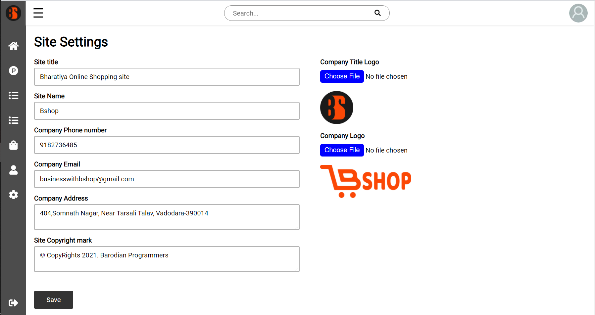
